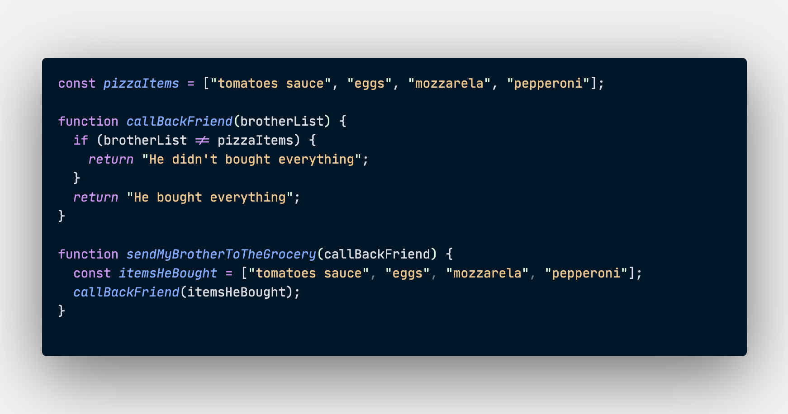

For a long time, I didn't have a clear answer to what is a "Callback function".  With a little help from Google and the magic keyword ELI5 (Explain Like I'm 5), I was able to get a pretty simple explanation about this concept. My goal here is to provide you a simple explanation of what is a Callback function.  

**DEFINITION**

A callback function is a function that we pass as an argument inside another function to handle some specific tasks after the core element of the function is executed.

As an example, we can take function A which using function B as an argument. When we execute the function A and all the core elements inside of it, we can execute the function B just after.

I will try to give you a real-life example of this concept and a code sample that will represent this example: 

Tonight is Friday night and I want to make a Pizza for dinner! I sent my little brother to the grocery to buy all the ingredients I will need (some tomato sauce, eggs, and cheese...), but I already know he will forget something. \
So I asked his best friend, "Callback," to go to the grocery with him and make sure he doesn't forget something. When my little brother will add everything in the cart, "Callback" will check if something is missing from the list and tell me if he didn't forget one of the ingredients I required.

I hope this little example gave you a better understanding of this concept, and now you will have no doubt when you will heard or see the term callback function somewhere.